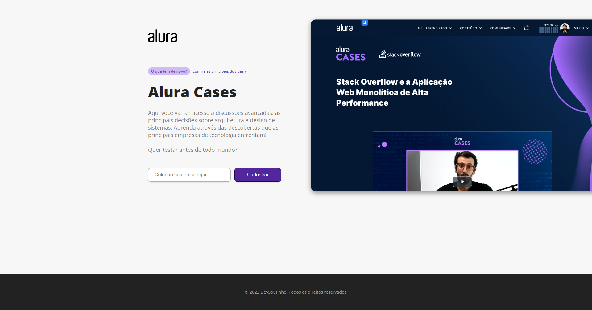
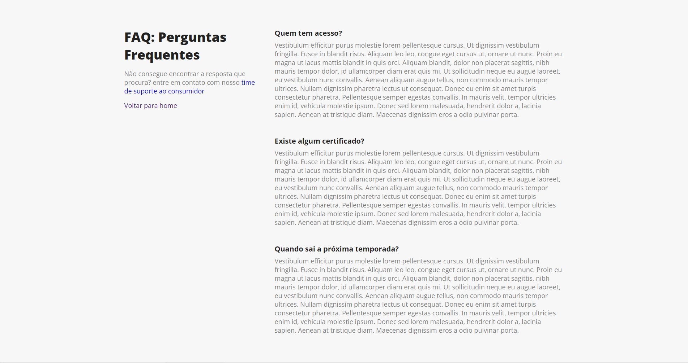

<h1>Alura Case</h1>

>projeto finalizado

<h3> Web site desnvolvido com Next.js em conjunto com os instrutores da Alura</h3>

<br>

acesse em: 

<hr>
<br>

<p>Tela principal: </p>



<p>Tela FAQ: </p>



<p>para rodar a aplicação: </p>

```
yarn i

yarn run dev
```
